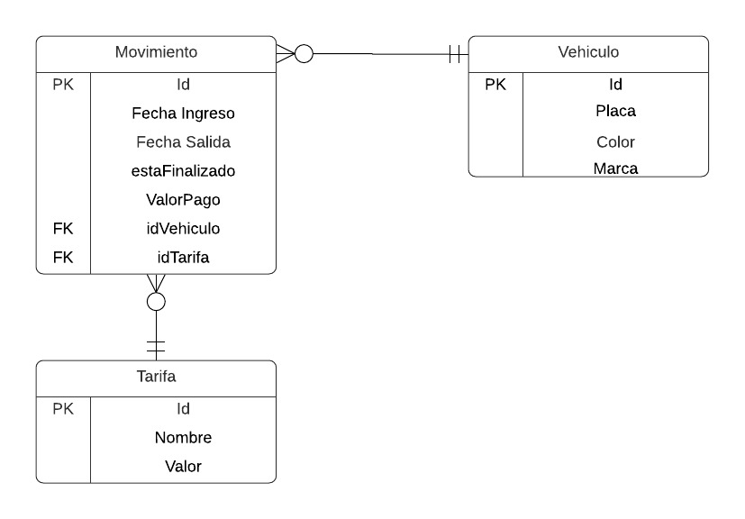

# pet-project-parqueadero
Reto pet project Sofka - Parqueadero

1. El proyecto deberá ser instalado antes de ser utilizado, la conexión a la base de datos deberá ser correctamente configurada desde el application.properties (MySql)

2. El backend realiza las validaciones pertinentes para el registro de vehiculos, tarifas y demás funcionalidades que tiene la aplicación.
El back es el encargado de enviar al front una respuesta con información de valor, como que error ha sucedidoo si la operación está registrada correctamente.

3. El modelo de la base de datos es 

4. El front está organizado en carpetas que tienen lo relacionado a cada funcionalidad, vehiculos, tarifas  y movimientos.
